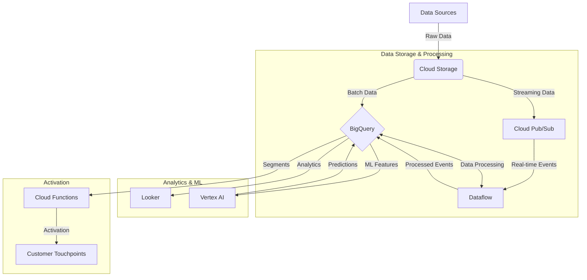
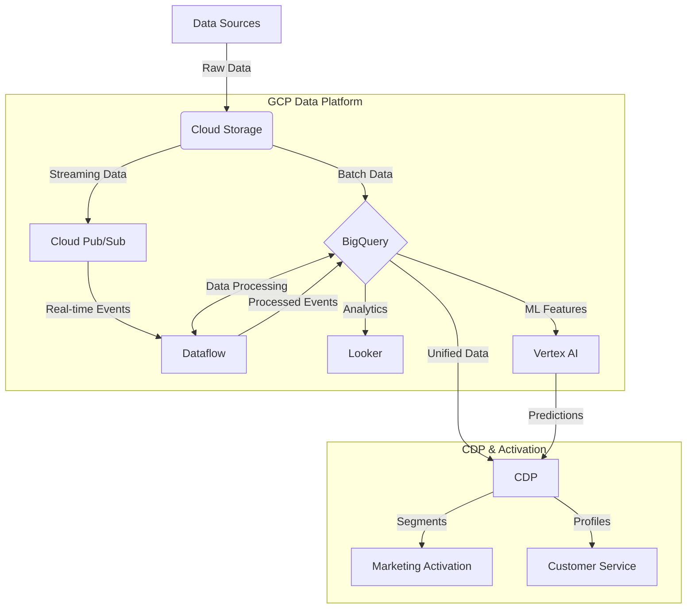

# Beyond the Hype: CDP as a Means, Not an End

## Customer Experience and Value: The True North of Data Strategy

In the age of data-driven marketing, it's easy to get caught up in buzzwords and hype. Customer Data Platforms (CDPs) have been at the center of this hype cycle for years. But let's take a step back and remember: A CDP is just a tool. The real goal? Delivering exceptional customer experiences and driving tangible business value.

---

## Core Aspects of a CDP

Before we dive into implementation strategies, let's recap what a CDP is supposed to do:

1. **Data Unification**: Combine customer data from multiple sources into a single, coherent profile.
2. **Identity Resolution**: Match different identifiers to the same individual across devices and channels.
3. **Segmentation**: Create and manage customer segments based on various attributes and behaviors.
4. **Activation**: Enable the use of customer data and segments across marketing and service channels.
5. **Real-time Processing**: Ingest and act on data in real-time or near-real-time.
6. **Privacy and Consent Management**: Manage customer consent and ensure compliance with data regulations.

These capabilities are meant to enable better customer experiences, more effective marketing, and improved business decision-making. But how we implement these capabilities can vary greatly.

---

## GCP-Only Solution: Leveraging Cloud Native Tools

A Google Cloud Platform (GCP) solution can deliver CDP-like capabilities using native cloud tools. Remember: Right tool for the right job is key.

**Key Components:**
- **Cloud Storage**: For raw data ingestion and storage
- **BigQuery**: Core data warehousing and analytics
- **Cloud Pub/Sub**: Real-time event ingestion
- **Dataflow**: For both batch and stream processing, used selectively for complex transformations
- **Looker**: Business intelligence and data exploration
- **Vertex AI**: Machine learning model training and deployment
- **Cloud Functions**: Serverless compute for lightweight processing and integrations

**Pros:**
- Highly scalable and cost-effective for large data volumes
- Flexible and customizable
- Tight integration with other GCP services

**Cons:**
- Requires significant development effort
- Lack of out-of-the-box CDP features

---

## Hybrid Solution: Best of Both Worlds

A hybrid solution combines the power of GCP with a dedicated CDP:

**Key Differences:**
- Dedicated CDP tool for customer data management and activation
- GCP handles heavy data processing and storage
- CDP focuses on unification, segmentation, and activation

**Pros:**
- Combines scalability of GCP with specialized CDP features
- Faster time-to-market for CDP capabilities
- Easier for marketers to use

**Cons:**
- Higher cost
- Potential data duplication
- Integration challenges

---

## Focus on Customer Value, Not Technology

Regardless of the approach, the focus should always be on delivering customer value. Here's how:

1. **Personalization at Scale**: Use unified customer data to deliver tailored experiences across all touchpoints.
   
   *Example:* A retail bank using real-time transaction data to offer personalized financial advice through their mobile app.

2. **Predictive Customer Service**: Leverage ML models to anticipate customer needs and proactively address issues.
   
   *Example:* A telecom provider predicting potential network issues and notifying affected customers before they experience problems.

3. **Journey Optimization**: Analyze customer journeys to identify and remove friction points.
   
   *Example:* An e-commerce company identifying cart abandonment patterns and implementing targeted interventions.

4. **Privacy-First Engagement**: Use consent data to ensure respectful, compliant customer communication.
   
   *Example:* A media company allowing granular control over data usage and content recommendations.

5. **Real-Time Relevance**: Respond to customer behaviors instantly with relevant offers or information.
   
   *Example:* A travel company detecting a customer searching for flights and proactively offering personalized travel packages.

---

## Key Takeaways

1. **CDP is a means, not an end**: The goal is improved customer experience and business value, not implementing a CDP.

2. **Choose the right architecture for your needs**: Whether it's a custom GCP solution, a dedicated CDP, or a hybrid approach, align your choice with your business goals and technical capabilities.

3. **Use the right tool for the right job**: Leverage GCP services strategically. Use Dataflow for complex processing needs, but don't overlook simpler, cost-effective solutions for straightforward tasks.

4. **Focus on use cases, not features**: Start with the customer experiences you want to enable, then work backwards to the necessary data and technology.

5. **Iterate and evolve**: Customer needs and technologies change. Your data strategy should be flexible enough to evolve with them.

6. **Measure what matters**: Focus on metrics that reflect customer satisfaction and business impact, not just technical implementation.

Remember, at the end of the day, your customers don't care about your CDP. They care about the experiences you provide and the value you deliver. Let that be your guiding light in all your data initiatives.